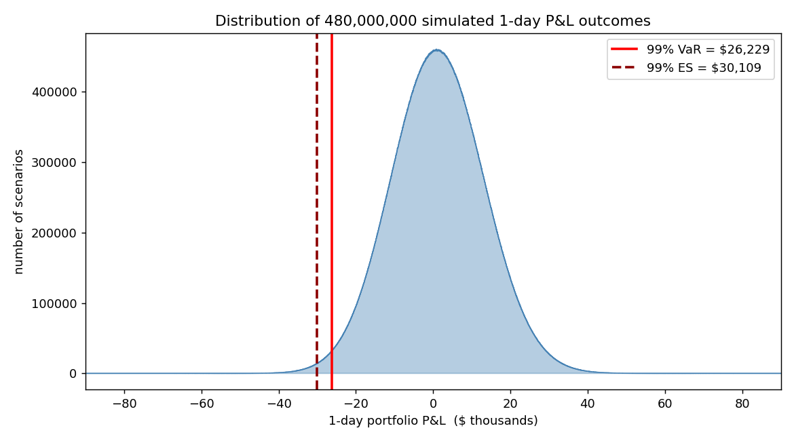
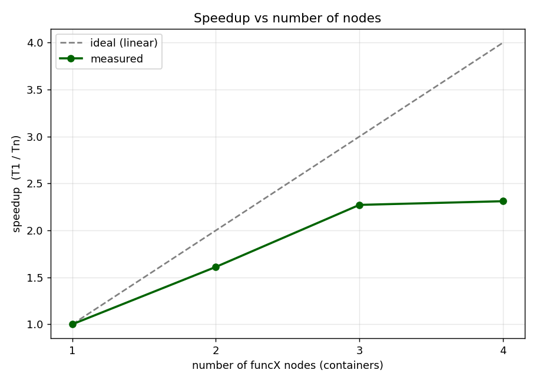

# Distributed Monte Carlo Value-at-Risk on funcX (Globus Compute)

Big Data project, use case: **Financial Analysis**.

This project computes the 1-day **Value-at-Risk (VaR)** and **Expected Shortfall (ES)** of a
$1,000,000 portfolio of ten US stocks using a **Monte Carlo simulation of 480 million scenarios**,
distributed across **four funcX (Globus Compute) endpoints**, each running in its own Docker
container. It also measures how the running time scales as nodes are added (1 to 4).

## Results

- 99% VaR: **$26,229** (2.62% of the portfolio)
- 95% VaR: $18,316 · 99% Expected Shortfall: $30,109
- Speed-up: **2.3x on 3 nodes**, then it saturates because all containers share one machine




## How it works

The client (orchestrator) estimates the mean return and covariance of the ten stocks from 3 years
of daily prices, splits the simulation into chunks, and submits them to the funcX endpoints through
the Globus Compute cloud. Each node simulates correlated next-day returns, turns them into portfolio
profit and loss, and returns a compact histogram. The client sums the histograms and reads VaR and
ES from them.

```
client (laptop)  ->  Globus Compute cloud  ->  4 endpoints (Docker)  ->  histograms  ->  VaR
```

## Project structure

```
src/model.py         prices, parameter estimation, VaR from histogram
src/montecarlo.py    the function that runs on each node
src/orchestrator.py  discover nodes, distribute, aggregate, measure, save
src/plots.py         the three result charts
data/prices.py       download and cache the price data
docker/              endpoint image, compose file, entrypoint, engine config
report/report.pdf    the full report (~3000 words)
results/             timings, VaR results, histogram
images/              charts and screenshots
```

## Running it

```bash
# 1. install dependencies
uv sync

# 2. download price data
uv run python data/prices.py

# 3. start 4 endpoint containers (needs Globus client credentials in docker/.env)
cd docker && docker compose up --build -d --scale endpoint=4 && cd ..

# 4. run the distributed experiment
uv run python src/orchestrator.py

# 5. build the charts
uv run python src/plots.py
```

> **Credentials.** The endpoints authenticate with Globus **client credentials**
> (`GLOBUS_COMPUTE_CLIENT_ID` and `GLOBUS_COMPUTE_CLIENT_SECRET`) kept in `docker/.env`.
> That file is **not** committed to the repository for security; provide your own to run the system.

## Report

The full report, following the required structure, is in `report/report.pdf`
(built from `report/report.tex`).
