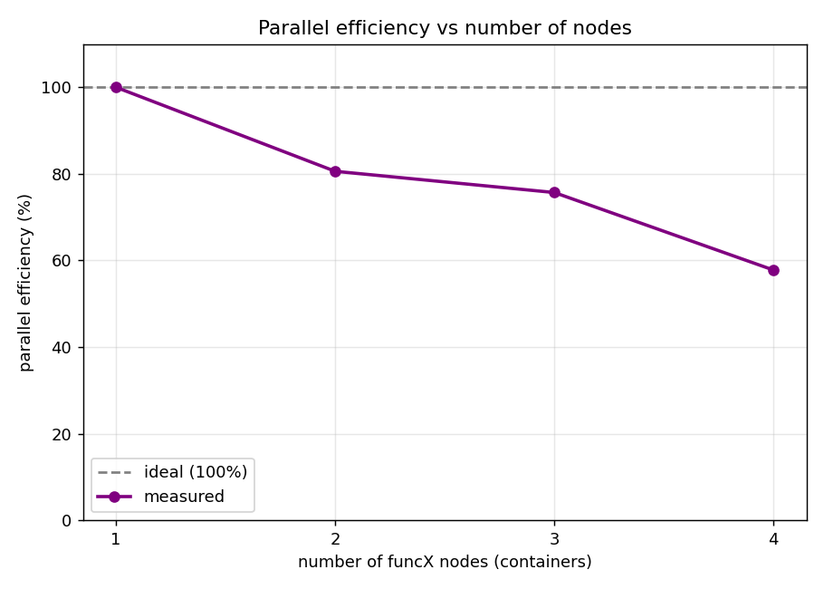
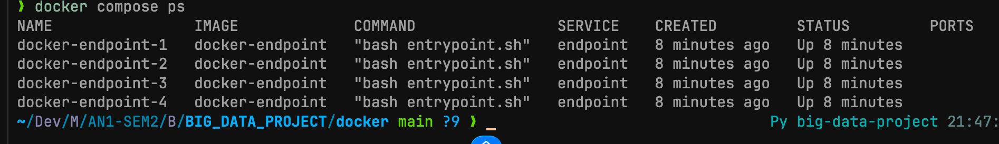
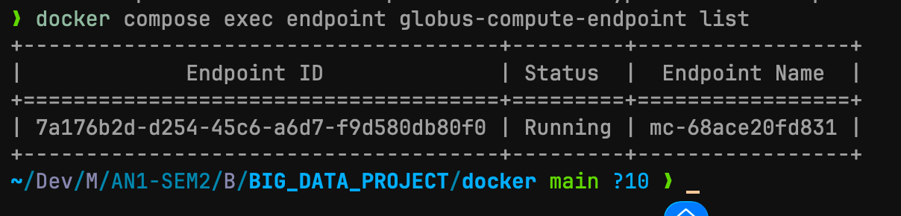
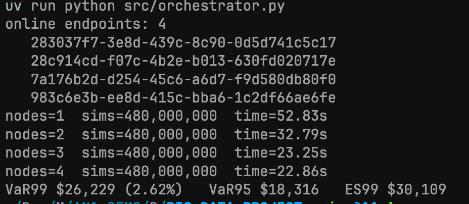

# Distributed Monte Carlo Value-at-Risk using funcX (Globus Compute)

### Big Data project, use case: Financial Analysis

## 1. Introducing the topic

### 1.1 What is the problem

Banks and investment funds hold large portfolios of shares. Every day they must answer one important question: *how much money could we lose tomorrow if the market moves against us?* This number is the portfolio's **market risk**. If it is underestimated, a single bad day can cost far more than the institution was prepared for. The most common way to measure this risk is **Value-at-Risk (VaR)**. VaR is the largest loss a portfolio is likely to suffer in one day, at a chosen confidence level. For example, a 1-day 99% VaR of $26,000 means that on about 99 days out of 100 the loss should stay below $26,000, and only roughly 1 day in 100 should be worse.

The difficulty is in *computing* this number. Markets are uncertain, and the shares in a portfolio move together in complicated ways. To get a trustworthy VaR we must test the portfolio against a very large number of possible "tomorrows", and this requires a lot of computing power. That is exactly where this project starts.

### 1.2 Why Big Data is necessary

To measure risk we use a method called **Monte Carlo simulation**. The idea is simple: instead of trying to predict tomorrow exactly, we let the computer *invent* a very large number of possible tomorrows at random, millions of them. For each invented day we calculate how much the portfolio would gain or lose. When we put all these results together, we see the full shape of what could happen, and from that shape we read the VaR. In this project we generate **480 million** such scenarios in a single run.

This is where Big Data becomes necessary, for two reasons. First, **volume**: every risk calculation creates and processes hundreds of millions of data points. Second, **speed**: a risk team often needs the answer fast, but a single computer working alone is too slow at this scale. The good news is that each simulated "tomorrow" is completely independent from the others, so they can all be computed at the same time. This kind of problem is called *embarrassingly parallel*, and it is a perfect fit for **distributed computing**, where the work is split across many machines (nodes) that run in parallel.

### 1.3 What software is needed (funcX / Globus Compute)

The software used in this project is **funcX**, now called **Globus Compute**. funcX is a *Function-as-a-Service* (FaaS) platform for distributed computing. In plain words, you write a normal Python function, and funcX runs it for you on remote computers called **endpoints**, then sends the result back. You do not have to manage any servers yourself. You simply submit a function and wait for the answer, almost like calling a function on your own laptop.

funcX fits our problem very well. Because the Monte Carlo simulations are independent, we can split them into chunks and send each chunk to a different endpoint. All endpoints work at the same time, and funcX gathers the results for us. One important detail is that the submitting program (the client) and the endpoints never talk to each other directly. They communicate through the **Globus Compute cloud service**, which receives the tasks, hands them to the endpoints, and returns the results. This cloud service is what makes funcX a *serverless* and *federated* computing platform.

### 1.4 The benefits of modeling with Big Data technology

Building the risk system with Big Data technology brings several clear benefits.

**Scalability.** If we need more accuracy (more scenarios) or a faster answer, we simply add more nodes. The same code runs on one node or on many, without being rewritten.

**Speed through parallelism.** Splitting the work across several nodes that run at the same time can give the answer much faster than a single machine, as long as there is enough work for each node to do.

**No server management.** With funcX we only write the function that does the maths. The platform takes care of sending the work out, running it, and bringing the results back. This is the *serverless* idea: we focus on the computation, not on the infrastructure.

**Flexibility and reproducibility.** Endpoints can live anywhere (a laptop, a server, or a cloud machine) and the platform treats them all the same way. Because the function and its inputs are fixed, the same calculation can be repeated and will give the same result, which matters for a risk report that must be checked and trusted.

## 2. The methodology

### 2.1 What the system is meant to do

The system has two goals at the same time: it calculates the 1-day risk of a fixed share portfolio, and it shows how distributed computing speeds that calculation up. The portfolio is made of ten large US stocks (Apple, Microsoft, Google, Amazon, Nvidia, Meta, Tesla, JPMorgan, Exxon and Johnson & Johnson). Each holding is worth $100,000, for a total portfolio value of $1,000,000.

The system works in four steps. First, it downloads three years of daily prices for the ten stocks and learns from them how much each stock usually moves and how the stocks move together. Second, it creates hundreds of millions of random "next days" based on this behaviour. Third, it spreads these simulations across several funcX nodes, which run them in parallel, and then it collects the results. Fourth, from all the simulated outcomes it reads three risk numbers: the 99% VaR, the 95% VaR, and the 99% Expected Shortfall. As a separate goal, the system repeats the whole calculation with one, two, three and four nodes and records the time, so we can measure the speed-up.

### 2.2 Research questions and how we address them

This project tries to answer three questions.

**Q1. Does the calculation get faster when we add more nodes?** We answer this by running exactly the same job (480 million simulations) first on one node, then on two, three and four nodes, and by measuring the time each run takes. From these times we compute the **speed-up**, which is the one-node time divided by the time on N nodes.

**Q2. How well does the work parallelise, and where does it stop helping?** A perfect system would run N times faster on N nodes. In practice there is always some overhead. We measure the **efficiency**, which is the speed-up divided by the number of nodes. An efficiency near 100% means the nodes are used well, while a falling efficiency shows us where the limit is.

**Q3. What is the actual risk of the portfolio?** We answer this by reading the 99% and 95% VaR and the 99% Expected Shortfall from the full set of simulated outcomes, and by checking that the distributed result agrees with a smaller calculation run on a single machine.

### 2.3 How many nodes (funcX nodes)

In funcX, a node is an **endpoint**: a place where functions actually run. In this project each endpoint runs inside its own **Docker container**, so one container equals one node. We use up to **four nodes**, which means four containers running side by side on the same computer.

Each container is set up to behave like a single worker: it runs one task at a time and is limited to one CPU core. This choice matters for the experiment. Because every container uses exactly one core, adding a container really means adding one more unit of computing power. This lets us measure cleanly what happens to the running time as the number of nodes grows from one to four.

### 2.4 The architecture

The system has three parts: the **client**, the **cloud service**, and the **nodes**.

The **client** (also called the orchestrator) runs on the local computer. It prepares the work: it loads the prices, learns the behaviour of the stocks, splits the simulations into chunks, sends the chunks out, collects the answers, and computes the final risk numbers.

The **Globus Compute cloud service** sits in the middle. The client never contacts the nodes directly. Instead it hands every chunk to the cloud service, which keeps the chunks in a queue and passes them to whichever node is free. When a node finishes, its result travels back through the cloud service to the client.

The **nodes** are the four Docker containers. Each one runs a funcX endpoint that receives a chunk, runs the simulation, and returns a small summary of the results. The diagram below shows how the parts fit together.

```
   Local computer (macOS)
   ┌────────────────────────────────────────────┐
   │  client / orchestrator                      │
   │  prices  ->  mu, covariance  ->  chunks     │
   │  collect results  ->  VaR, ES, timings      │
   └───────────────────┬────────────────────────┘
                       │  submit chunks / receive results
                       ▼
        ┌───────────────────────────────┐
        │   Globus Compute cloud         │   (task queue + router)
        └───────────────┬───────────────┘
                        │  hands chunks to free nodes
        ┌──────────┬────┴────┬──────────┐
        ▼          ▼         ▼          ▼
   ┌────────┐ ┌────────┐ ┌────────┐ ┌────────┐
   │ node 1 │ │ node 2 │ │ node 3 │ │ node 4 │   Docker containers
   │endpoint│ │endpoint│ │endpoint│ │endpoint│   (1 worker, 1 core each)
   └────────┘ └────────┘ └────────┘ └────────┘
```

### 2.5 Diagrams, pseudocode and workflow

The workflow follows the four steps described earlier. The pseudocode below shows the two key pieces: the function that runs on each node, and the orchestrator that drives the whole process.

The **node function** receives the description of the stocks and a number of scenarios to simulate. It draws random next-day returns that respect how the stocks move together, turns them into portfolio gains and losses, and returns a small histogram (a count of how many outcomes fell into each money bucket). Returning a histogram instead of the raw numbers keeps the message small, which is important for speed.

```
function SIMULATE_CHUNK(mu, L, positions, n_scenarios, seed):
    counts = array of zeros, one per histogram bucket
    repeat in blocks until n_scenarios are done:
        z   = random normal numbers
        r   = mu + z * L
        pnl = positions * (e^r - 1)
        add pnl into the histogram counts
    return counts
```

The **orchestrator** prepares the inputs once, then splits the total work into chunks, sends them to the nodes, adds up all the returned histograms, and reads the risk numbers from the combined histogram.

```
function RUN(nodes):
    mu, L, positions = estimate from 3 years of prices
    chunks = split TOTAL_SCENARIOS into equal pieces
    start timer
    for each chunk i:
        send SIMULATE_CHUNK to node[i mod number_of_nodes]
    total = sum of all returned histograms
    stop timer
    VaR99, VaR95, ES99 = read from total histogram
    return VaR99, VaR95, ES99, elapsed_time
```

The full experiment simply calls RUN four times, once with one node, then with two, three and four nodes, and records each time.

## 3. Implementation

### 3.1 How the implementation is deployed

The nodes are deployed with **Docker**. A small image is built from Python 3.13 and contains the funcX endpoint software and NumPy. Using **Docker Compose**, all four nodes are started with a single command, by asking Compose to scale the endpoint service to four copies. Each container starts its endpoint automatically when it boots, connects to the Globus Compute cloud, and is then ready to receive work.

A key point is how the containers log in. A funcX endpoint must prove who it is to the cloud service, and normally a person does this by clicking a login link in a browser. That does not work inside an automatic container. Instead, the project uses **client credentials**: a kind of service account made of an ID and a secret. The same ID and secret are given to every container and to the client, so they all act as the same identity and trust each other, with no human login needed. This is what allows the four nodes to start on their own and to scale up easily.

The **client** (the orchestrator) runs directly on the local computer (an Apple M4 laptop) inside a Python environment managed by the uv tool. It reads the same credentials, submits the work to the four nodes, and writes the results to disk.

### 3.2 Which are the assumptions

The model rests on a few assumptions, and it is honest to state them clearly.

**Normal returns.** We assume that daily returns follow a normal (bell-shaped) distribution. This is the standard textbook assumption and it is easy to work with. In reality, markets have "fat tails", meaning that very large crashes happen more often than a normal distribution predicts. Because of this, our VaR can understate the risk of rare, extreme days.

**The past predicts the future.** We learn the average return and the way the stocks move together from the last three years of prices, and we assume that tomorrow behaves in the same way. In calm periods this is reasonable, but in a crisis the behaviour can change fast, and stocks tend to fall together more than usual.

**Fixed one-day positions.** We assume the portfolio is not traded during the day and we look only one day ahead. The ten holdings and their values stay the same for the whole calculation.

**Cached data and an available cloud.** The prices are downloaded once and saved to a file, so every run uses exactly the same data and the results can be reproduced. We also assume that the internet and the Globus Compute cloud are available, because funcX always routes the work through the cloud.

### 3.3 System services

The running system is made of a few services that work together.

**The endpoint service.** Inside each container, the funcX endpoint runs as a long-living process. When it starts, it registers with the cloud and is given a unique ID. From then on it waits for tasks, runs them on its single worker, and sends the results back. Because the container keeps this process in the foreground, the node stays alive and online for as long as the container runs.

**The cloud service.** The Globus Compute cloud is the shared service that connects everything. It accepts tasks from the client, keeps them in a queue, gives them to free endpoints, and returns the finished results. Neither the client nor the nodes need to know each other's network address, because the cloud handles all of this.

**The orchestrator.** On the local machine, the orchestrator program is the service that starts each experiment. It builds the inputs, opens a connection to each node, sends out the chunks, collects the histograms, computes the risk numbers, and saves three output files: a table of timings, the risk results, and the combined histogram used to draw the charts.

## 4. Validation and evaluation

### 4.1 Presenting the system functionality

The system was run from start to finish and worked as designed. When the orchestrator starts, it first finds the four online endpoints, then sends out the simulation chunks and waits for the histograms to come back. After the chunks are combined, it prints the three risk numbers and saves the output files.

To make sure the maths is correct, the same calculation was also run on a single machine, without funcX, using a smaller number of scenarios. The two results agreed closely: the single-machine 99% VaR was about $26,200, and the distributed 480-million-scenario run gave $26,229. This match gives us confidence that splitting the work across nodes does not change the answer, it only changes the speed.

### 4.2 Reporting results

**Risk results.** Using 480 million simulated next-day outcomes, the system produced the following risk numbers for the $1,000,000 portfolio:

| Measure | Value | As % of portfolio |
|---|---|---|
| 99% Value-at-Risk | $26,229 | 2.62% |
| 95% Value-at-Risk | $18,316 | 1.83% |
| 99% Expected Shortfall | $30,109 | 3.01% |

In plain words, on a normal day the portfolio is very unlikely to lose more than about $26,000 (with 99% confidence). On the worst 1% of days, the average loss is about $30,000. The figure below shows the full distribution of simulated outcomes, with the 99% VaR and Expected Shortfall drawn as vertical lines on the loss side.


**Speed results.** The same 480-million-scenario job was run on one, two, three and four nodes. The table shows the time, the speed-up and the efficiency for each case:

| Nodes | Time (s) | Speed-up | Efficiency |
|---|---|---|---|
| 1 | 52.83 | 1.00× | 100% |
| 2 | 32.79 | 1.61× | 81% |
| 3 | 23.25 | 2.27× | 76% |
| 4 | 22.86 | 2.31× | 58% |

The speed-up grows steadily up to three nodes, reaching about 2.3 times faster, and then it flattens: a fourth node gives roughly the same result as three. The two charts below show the same story: the speed-up rises towards the ideal line and then levels off, while the efficiency stays above 75% up to three nodes and then falls to about 58%.




### 4.3 Print-screen with the system

The screenshots below were taken on the running system.

**Screenshot 1.** The four endpoint containers running at the same time, listed by Docker.



**Screenshot 2.** One of the funcX endpoints inside its container, registered with the cloud and in the "Running" state.



**Screenshot 3.** The orchestrator running the experiment: it finds the four endpoints, runs the job on one, two, three and four nodes, prints the time for each, and ends with the final risk numbers.



### 4.4 Explain the print-screens

**Screenshot 1** proves that the deployment really is distributed. The command `docker compose ps` lists four separate containers, named endpoint-1 to endpoint-4, all in the "Up" state. Each of these is one node of the system.

**Screenshot 2** shows the funcX side of a node. Running `globus-compute-endpoint list` inside a container prints the endpoint's unique ID and its status, which is "Running". This confirms that the container has connected to the Globus Compute cloud and is ready to receive work. The endpoints belong to the service identity used for the client credentials, so they appear here in the terminal rather than on a personal web page.

**Screenshot 3** shows the system actually working. The orchestrator first lists the four endpoint IDs it discovered, then prints one line per run with the number of nodes and the time taken, and finally prints the three risk numbers. This single screen captures both results of the project at once: the risk figures and the speed-up across nodes.
